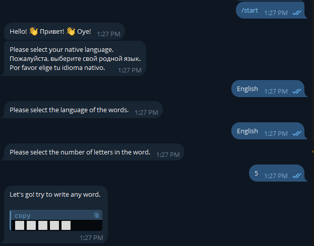
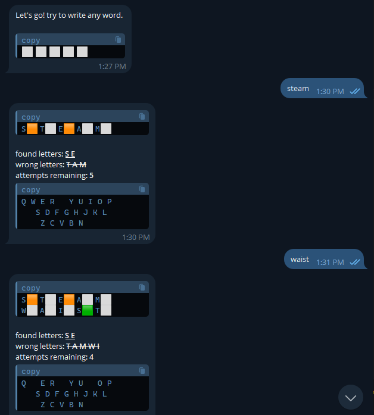
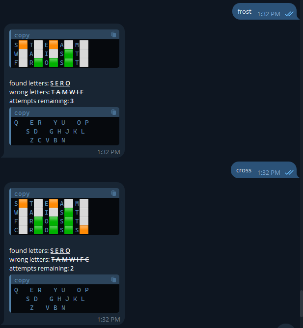
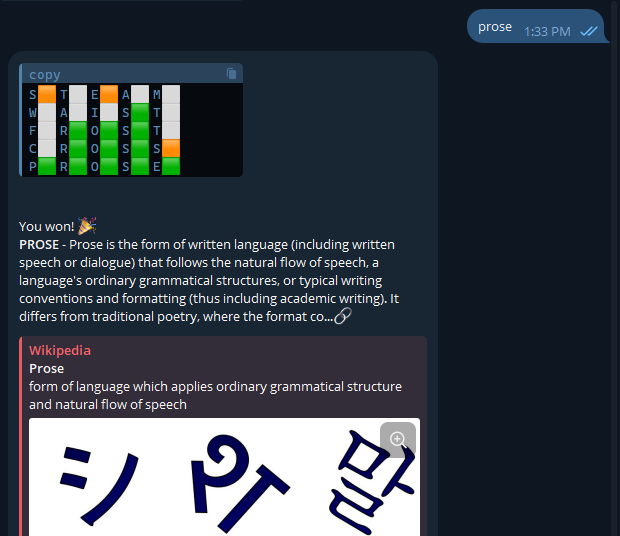

# WordleBot

WordleBot is a fun and educational Telegram bot that brings the popular Wordle game to Telegram users. The bot supports multiple languages, including English, Russian, and Spanish, making it accessible to a wide range of users.

The game works by having users guess a word of a certain length, which they can choose at the start of the game.

WordleBot is perfect for language learners, trivia enthusiasts, and anyone who enjoys word games. It's a great way to challenge your vocabulary and learn new words in different languages.

## Features

- Supports multiple languages: English, Russian, Spanish
- Allows users to choose the number of letters in the word to guess
- Provides hints from Wikipedia

## Example Images









## Setup

1. Clone the repository:
```sh
git clone git@github.com:sukhrobyangibaev/wordlebot.git
```

2. Create Virtual Environment
```sh
python -m venv venv
```

3. Activate Virtual Environment
```sh
source venv/Scripts/activate
```

4. Install the required dependencies:
```sh
pip install -r requirements.txt
```

5. Run the bot
```sh
python main.py
```